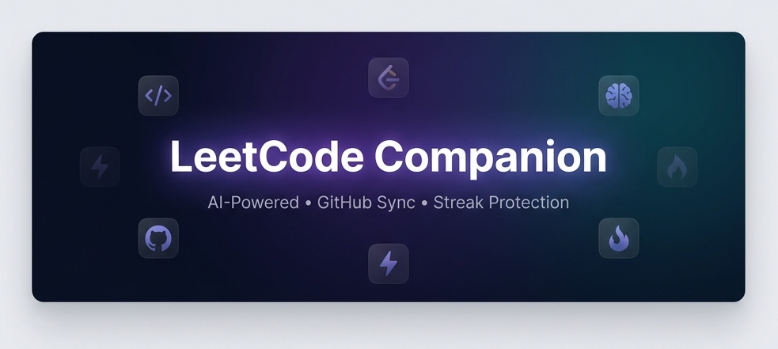
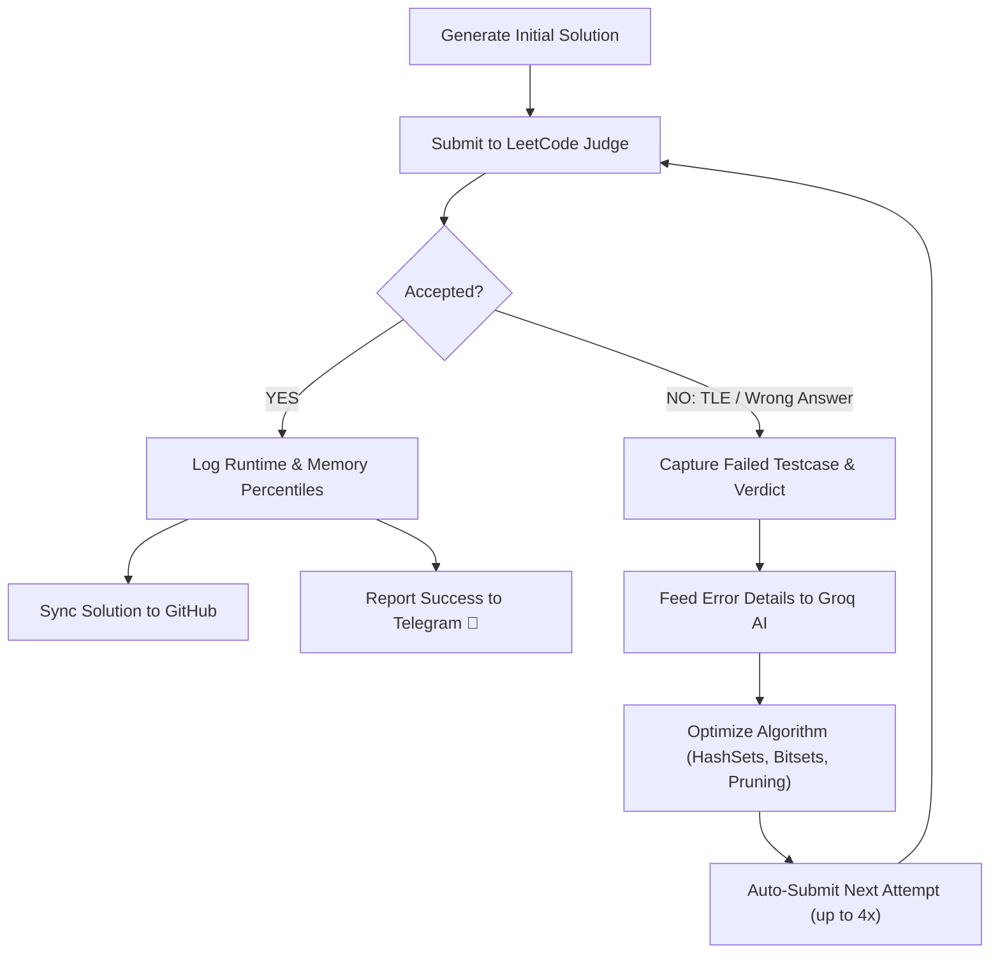

<div align="center">

  

  <br />
  <a href="https://git.io/typing-svg">
    
  </a>
  <br />

  <p><strong>Autonomous 24/7 Cloud Auto-Solver, Telegram Bot Controller, Self-Healing Judge Feedback Loop, and Chrome Extension.</strong></p>

  <p>
    <a href="https://github.com/anmolnagpal18/leetcode-solver"></a>
    <a href="https://developer.chrome.com/docs/extensions/mv3/"></a>
    <a href="https://nodejs.org/"></a>
    <a href="https://telegram.org/"></a>
    <a href="LICENSE"></a>
  </p>

  <p>
    <a href="https://groq.com"></a>
    <a href="#-cse476-ca1-project-1-build-a-real-agent-submission"></a>
    <a href="#2-autonomous-self-healing-feedback-loop"></a>
  </p>

  <p>
    24/7 Cloud Execution &nbsp;·&nbsp; Laptop-OFF Solving &nbsp;·&nbsp; Self-Healing Judge Loop &nbsp;·&nbsp; Zero-Click Sync &nbsp;·&nbsp; GitHub Portfolio
  </p>

  <br />

  

</div>

<br />

---

## 🎓 CSE476 CA1 Project 1: Build a Real Agent (Submission Write-up)

**Course:** CSE476 Agentic AI and Intelligent Automation  
**Student Name:** Anmol Nagpal  
**Submission Type:** Solo Submission | **Maximum Marks:** 30  
**Demo Notebook:** [`demo.ipynb`](demo.ipynb) | **CLI Demo:** `python run_demo.py`

> **The Core Rule: An Agent, Not a Chatbot.**  
> *"A chatbot is a vending machine, one question in, one answer out. An agent is an intern: you give it a goal and it decides which tools to use, does several steps, remembers what it found, and comes back with a result."*

### 📝 The Three Submission Paragraphs:

**1. The Tools (`fetch_problem_spec` and `execute_code_sandbox`):**  
Our agent operates two real functional tools to act on programming tasks rather than simply predicting text. The first tool, `fetch_problem_spec(query)`, queries LeetCode problem specifications, parsing the formal title, constraints, and test cases (using an online GraphQL client with an offline catalog fallback). The second tool, `execute_code_sandbox(code, testcases, language)`, compiles and executes the candidate solution inside an isolated execution environment, verifying stdout, assertion correctness, and execution runtime against each test case before returning a formal verification verdict.

**2. What the Memory Does:**  
The agent features a dual-layer memory system implemented in [`memory.py`](memory.py) comprising conversational history and an active working state buffer. The conversational memory records past dialogue turns, while the working state tracks the current problem ID, target programming language, and verification status. In multi-turn dialogues, when the user asks ambiguous follow-up requests (such as *"recommend a follow-up problem using a similar concept in C++"*), the agent reads back its memory of the previous turn (*"Two Sum in Python"*) to resolve entity references and maintain continuity without requiring repetitive user prompts.

**3. One Honest Failure Hit and How We Handled It:**  
During initial development, our agent frequently produced code that appeared syntactically valid but failed edge cases or timed out on non-adjacent inputs (for example, generating a naive adjacent-element search for Two Sum which failed when matching pairs were separated across the array). Rather than allowing the agent to fail silently or output an unverified answer like a conventional chatbot, we incorporated a dynamic ReAct self-healing feedback loop. When `execute_code_sandbox` observes a `Wrong Answer` or test failure, the agent catches the failure observation, inspects the failed test case, diagnoses the algorithmic flaw, synthesizes an optimal Hash Map approach, and autonomously triggers a second sandbox execution to achieve 100% test pass verification.

---

### 🔍 Viva Reference Guide (10 Marks)

| Viva Question | Exact Code Location | Walkthrough Explanation |
|---|---|---|
| **1. Where does the plan-act loop decide the next step?** | [`agent.py: lines 185–260`](agent.py#L185-L260) | The `run()` method maintains a step counter and loop state. After calling each tool, it inspects `observation.get("status")`. If the status is not `"PASSED"`, it branches dynamically into the self-correction block to refine the code and re-test instead of exiting. |
| **2. Walk through a tool call.** | [`agent.py: lines 211–220`](agent.py#L211-L220) $\rightarrow$ [`tools.py: lines 140–235`](tools.py#L140-L235) | The agent prepares `tool_args` (code, testcases, language) and invokes `self.tools["execute_code_sandbox"]["fn"](**tool_args)`. The tool executes the solution in an isolated dictionary scope (`exec`), feeds each test input, compares actual vs expected output, and records execution time. |
| **3. Show where memory is read back.** | [`agent.py: lines 168–180`](agent.py#L168-L180) $\rightarrow$ [`memory.py: lines 65–85`](memory.py#L65-L85) | In `agent.py`, `_extract_intent_and_entities()` and `run()` call `self.memory.get_recent_history()` and `self.memory.get("last_problem_id")`. This resolves pronouns like *"this problem"* or *"follow-up"* back to the problem stored in previous turns. |

---

## 💡 The Problem & The Solution

You have a **70-day streak** on LeetCode. You're traveling, your laptop is closed, you have exams, or you're away from your desk. By midnight, your streak is gone. 

Even worse, when an AI generates a solution, it might pass 53 out of 55 test cases and hit **Time Limit Exceeded (TLE)** on the last two, leaving you stuck.

**LeetCode Solver completely changes this:**
1. **Runs 24/7 in the Cloud:** Works from your phone on Telegram even when your laptop, Windows, and Chrome are **completely turned OFF**.
2. **Autonomous Self-Healing Loop:** If a solution hits TLE or Wrong Answer, the bot captures the judge feedback, refines the algorithm with Groq AI, and retries automatically until **Accepted**!
3. **Zero-Click Account Sync:** No copying cookies, no F12 DevTools. Chrome extension silently links your authenticated account to the cloud backend.
4. **In-Browser Companion:** Instant AI explanations, hints, and Monaco editor injection when you are actively coding on your computer.

<br />

---

## 🏛️ System Architecture

```text
                    ┌────────────────────────────┐
                    │      LeetCode Servers      │
                    │   (GraphQL & Submissions)  │
                    └──────────────▲─────────────┘
                                   │
                    ┌──────────────┴─────────────┐
                    │     24/7 Cloud Backend     │
                    │   (Node.js / Express API)  │
                    │                            │
                    │ • Problem Search Engine    │
                    │ • Groq AI Grandmaster      │
                    │ • Self-Healing Retry Loop  │
                    │ • Midnight UTC Scheduler   │
                    │ • Telegram Bot Service     │
                    └──────▲──────────────▲──────┘
                           │              │
              ┌────────────┴─┐          ┌─┴────────────┐
              │ Telegram App │          │ Chrome Ext.  │
              │  (24/7 📱)   │          │ (Popup & DOM)│
              └──────────────┘          └──────────────┘
```

* **Laptop OFF (Cloud Mode):** Telegram Bot communicates with the Cloud Backend to generate solutions, submit directly to LeetCode, poll the real judge, and sync commits to GitHub.
* **Laptop ON (Browser Mode):** Chrome extension provides on-page AI explanations, Monaco editor code injection, and automatic background cookie sync.

<br />

---

## 🚀 Key Features

### 1. 24/7 Laptop-OFF Cloud Auto-Solver
Trigger solutions from anywhere in the world straight from your Telegram phone app:
* `/solve 1` $\rightarrow$ Solves **#1 Two Sum** (default Python).
* `/solve 1452 cpp` $\rightarrow$ Solves **#1452** in C++.
* `/solve walking robot` $\rightarrow$ Resolves by title or partial name.
* Works with **zero dependence on Chrome or your laptop being powered on**.

---

### 2. Autonomous Self-Healing Feedback Loop
Most bots fail once and stop. LeetCode Solver runs an **iterative self-healing loop**:



* If LeetCode returns `Time Limit Exceeded (Passed: 53/55 test cases)`:
  * The bot captures the failed input.
  * Sends it back to Groq AI to replace naive approaches with $O(N)$ or $O(N \log N)$ optimal algorithms.
  * Automatically submits Attempt 2, 3, 4 until all test cases pass!

---

### 3. Telegram Bot with Clickable Buttons & Command Menu
* **Interactive Button Keyboard:** Persistent buttons at the bottom of the chat (`📅 /today`, `📊 /status`, `💡 /solution`, `🚀 /solve`, `📖 /question`, `🎲 /random`, `🔗 /account`, `❓ /help`) so you can execute commands with one tap.
* **Official Command Menu:** Registered via `setMyCommands` in Telegram's built-in `[/]` drawer.
* **Flexible Input:** Type full custom commands like `/solve 874 cpp` or `/question two-sum` anytime.

---

### 4. Zero-Click Account Sync & Security
* **No DevTools needed:** Whenever you open Chrome with LeetCode logged in, the extension automatically detects your session and links it to the 24/7 Cloud Bot in the background!
* **1-Click Sync Button:** Or click **`🔗 Sync Account`** in Extension Settings for instant confirmation.
* **Full Account Lifecycle:** Manage everything from Telegram with `/account`, `/link`, and `/unlink`.
* **Security First:** Session tokens are stored in a local, `.gitignore`-protected database (`backend/data/credentials.json`) and are never exposed.

---

### 5. Automatic GitHub Portfolio Synchronization
Every accepted solution is automatically formatted and committed to your GitHub repository (e.g. `anmolnagpal18/leetcode-solutions`):
* Includes problem title, difficulty, full markdown description, constraints, and time/space complexities.
* Self-healing Git tree conflict resolution with cache-busting SHA recovery.

---

### 6. Chrome Extension In-Browser Companion
* **Monaco Editor Bridge:** Automatically types AI solutions into LeetCode's in-browser editor with one click.
* **Interactive AI Sidebar:** Draggable panel explaining algorithmic approaches step-by-step.
* **Quick Search UI:** Search any problem in the popup and choose **`📖 View`**, **`💡 Solution`**, or **`🚀 Solve Now`**.

<br />

---

## 📱 Telegram Command Reference

| Command | Description | Example |
|---|---|---|
| **`/status`** | Live health check of Cloud Backend, Telegram, LeetCode API, Groq AI, Auth, and GitHub | `/status` |
| **`/today`** | Today's active LeetCode Daily Challenge details and solve status | `/today` |
| **`/question [query]`** | Full problem statement, examples, constraints, and tags | `/question 1` or `/question` |
| **`/solution [query] [lang]`** | Generates optimal approach, time/space complexities, and code block | `/solution 874 cpp` |
| **`/solve [query] [lang]`** | Full autonomous pipeline: generation, submission, judge checking, and self-healing retries | `/solve 1452 cpp` |
| **`/random [difficulty]`** | Picks a random challenge (optional filter: `easy`, `medium`, `hard`) | `/random medium` |
| **`/account`** | Displays currently linked LeetCode username and 24/7 submission readiness | `/account` |
| **`/link`** | Connects your LeetCode account interactively | `/link` |
| **`/unlink`** | Disconnects and permanently clears stored session credentials | `/unlink` |
| **`/help`** | Displays the complete user manual and tips | `/help` |

<br />

---

## 🛠️ Project Structure

```
leetcode-solver/
├── README.md                            # Complete Project Documentation & CA1 Report
├── demo.ipynb                           # 📓 Interactive Jupyter Notebook Demo (Multi-step traces)
├── run_demo.py                          # ⚡ Standalone CLI Demo Runner
├── agent.py                             # 🤖 Autonomous ReAct Agent Loop
├── tools.py                             # 🛠️ Agent Tools (Problem fetcher, Sandbox, Complexity)
├── memory.py                            # 🧠 Conversational & Working Memory Module
├── manifest.json                        # Chrome Extension Manifest V3
├── LICENSE                              # MIT License
│
├── 📂 backend/                          # 24/7 Cloud Backend Server
│   ├── Dockerfile                       # Container deployment config
│   ├── package.json                     # Node.js dependencies
│   ├── .env.example                     # Environment variables template
│   ├── 📂 src/
│   │   ├── bot.js                       # 24/7 Telegram bot controller & self-healing solver
│   │   ├── leetcode.js                  # Search engine, GraphQL API, direct submission judge
│   │   ├── groq.js                      # Grandmaster AI model & feedback loop
│   │   ├── credentials.js               # Persistent LeetCode session manager
│   │   ├── scheduler.js                 # Midnight UTC daily challenge scheduler
│   │   ├── server.js                    # Production HTTP API (/health, /status, /api/auth/link)
│   │   └── github.js                    # Safe GitHub commit & sync client
│   └── 📂 tests/
│       └── test.js                      # Test suite (28/28 automated unit tests)
│
├── 📂 src/                              # Chrome Extension
│   ├── 📂 background/
│   │   └── service-worker.js            # Background runner & zero-click session sync
│   ├── 📂 content/
│   │   ├── detector.js                  # DOM observer for accepted submissions
│   │   ├── injector.js                  # Draggable AI learning sidebar
│   │   └── editor-injector.js           # Monaco editor typing bridge
│   ├── 📂 lib/
│   │   ├── groq-api.js                  # Extension Groq API client
│   │   ├── github-api.js                # Extension GitHub sync client
│   │   └── storage.js                   # Chrome storage helpers
│   └── 📂 popup/
│       ├── popup.html / popup.js        # Quick problem search & action cards
│       └── settings.html / settings.js  # Settings & 1-Click Sync button
│
└── 📂 assets/                           # Extension icons and screenshots
```

<br />

---

## ⚡ Quickstart Guide

### Option 1: Run Agent Demo (Python)
Run the autonomous multi-step agent demo right from your terminal:
```bash
python run_demo.py
```
Or open the interactive Jupyter Notebook:
```bash
jupyter notebook demo.ipynb
```

---

### Option 2: Run 24/7 Backend Locally (Desktop)

1. **Navigate to backend:**
   ```bash
   cd backend
   npm install
   ```
2. **Configure environment:**
   Create `backend/.env` (use `backend/.env.example` as reference):
   ```env
   PORT=3000
   GROQ_API_KEY=gsk_...
   TELEGRAM_BOT_TOKEN=...
   TELEGRAM_CHAT_ID=...
   GITHUB_TOKEN=ghp_...
   GITHUB_REPO=anmolnagpal18/leetcode-solutions
   ```
3. **Start the backend:**
   ```bash
   npm start
   ```

---

### Option 3: Load the Chrome Extension

1. Open Google Chrome and go to **`chrome://extensions/`**.
2. Turn on **Developer mode** (top right toggle).
3. Click **Load unpacked** (top left).
4. Select this root folder (containing `manifest.json`).
5. Open the Extension $\rightarrow$ Click **`⚙️ Settings`** $\rightarrow$ Click **`🔗 Sync Account`**!

<br />

---

## 🔒 Security & Privacy

* **Strictly Protected Secrets:** All sensitive credentials (`.env`, `backend/.env`, and `backend/data/credentials.json`) are ignored in `.gitignore` and are **never committed to Git**.
* **Direct Communication:** Telegram commands and LeetCode submissions communicate directly with official APIs over TLS/HTTPS.
* **Zero Tracking:** No external analytics, telemetry, or third-party ads.

<br />

---

## 👨‍💻 Author

<div align="center">

**Designed & Engineered by Anmol Nagpal**

[](https://github.com/anmolnagpal18)
[](https://t.me/leetcode_solverbot)

</div>

<br />

---

<div align="center">
  <sub>⭐️ If you find this project helpful, please consider starring the repository!</sub>
</div>
